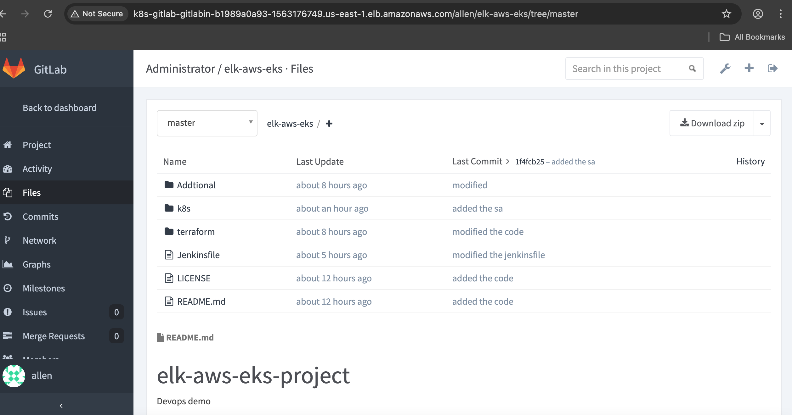
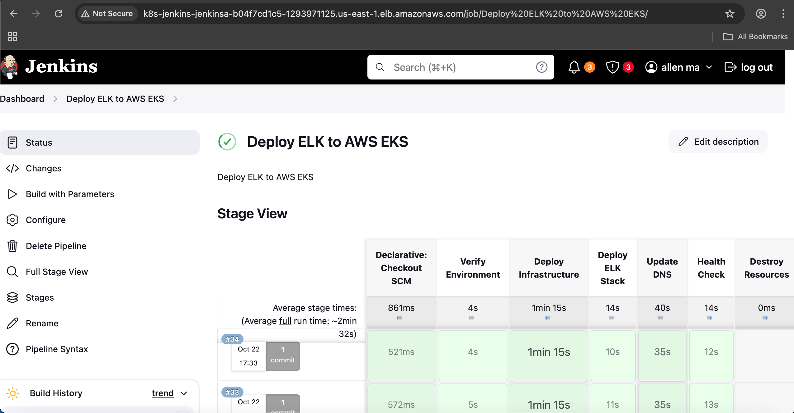
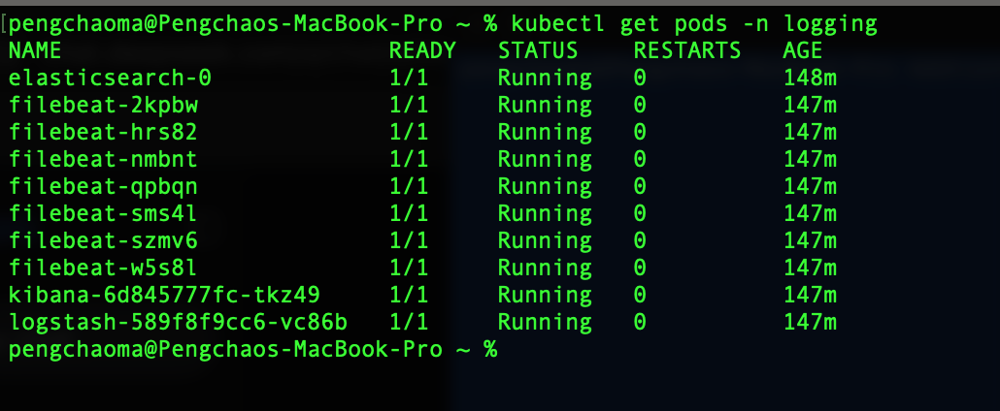
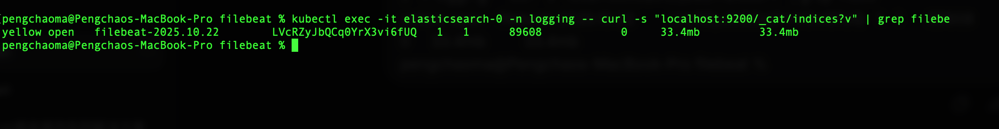
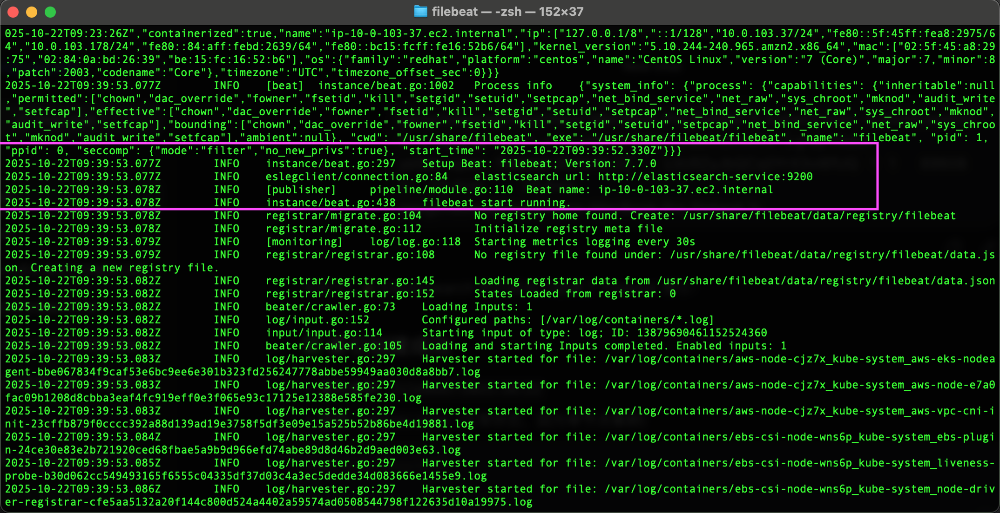
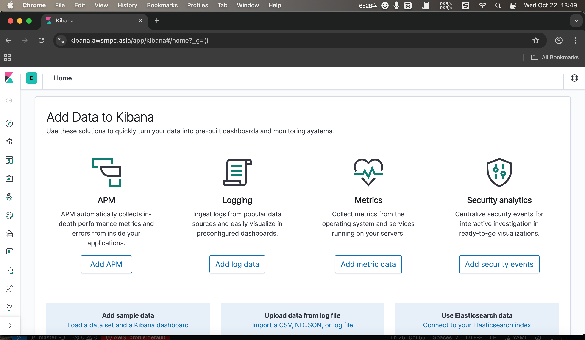
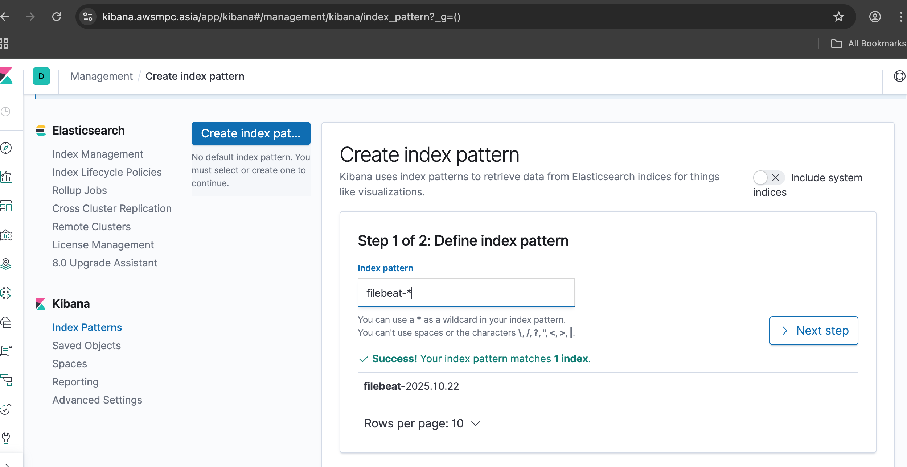
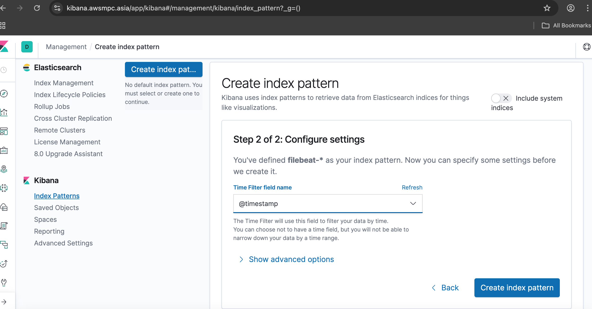
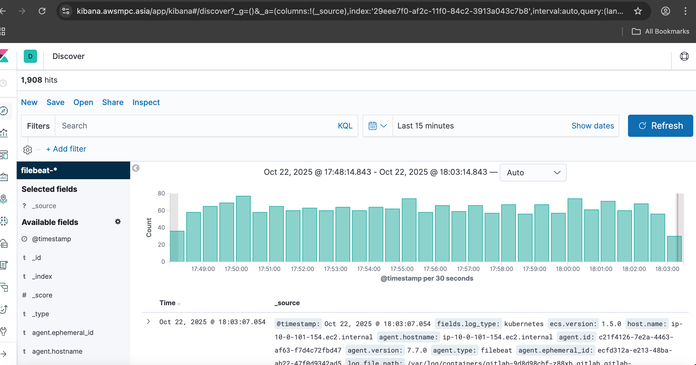
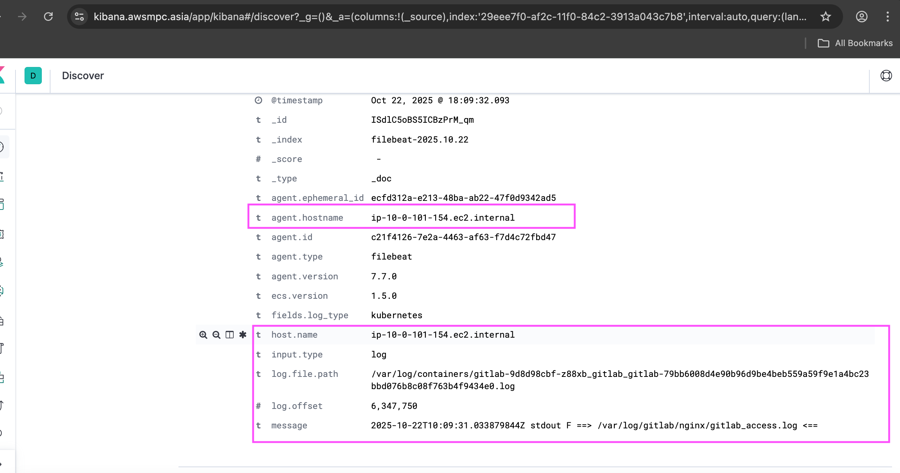

# ELK-Logging-Deploy-AWS-EKS

In this demo, I will show you how to deply ELK (Elastisearch,Logstash,Kibana) to AWS EKS for a logging system. For a security concern, I also using a domain named awsmpc.asia and using ACM for HTTPS connection, I also deployed ALB for kibana client access.

# Features

- Terraform to create ACM,DNS,Route 53 hosted zone

      - ACM for free SSL certificate
      - Update DNS for ALB with kibana.awsmpc.asia
      - Route 53 for AWS hosted zone awsmpc.asia

- GitLab for code repository CI part

- Jenkins Pipeline with Jenkinsfile for CD part

- Elasticache 7.0, Logstash 7.0, Kibana 7.0 from Elasticache Official image

    (Since my EKS don't have enough memory,So I choose tight version 7.0)

- PVC created to store logs with AWS storageclass gp3, EBS csi driver

- ALB creted for Kibana clinet access

## Usage

- GitLab manage the code repository



- Jenkins pipeline for the CD part



- Pods running on AWS EKS



- Check elastisearch logs whether has the filebeat files
```shell
kubectl exec -it elasticsearch-0 -n logging -- curl -s "localhost:9200/_cat/indices?v" | grep filebe
```



- Check filebeat logs whether has elastisearch connected

```shell
kubectl logs filebeat-pf8wt -n logging
```



- Kibana Home page



- Kibana index setup





- Kibana discovery page



- Pod details check

